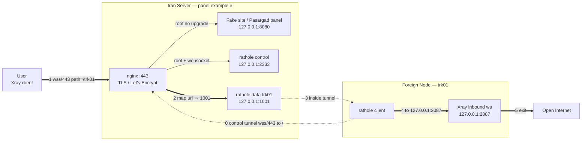
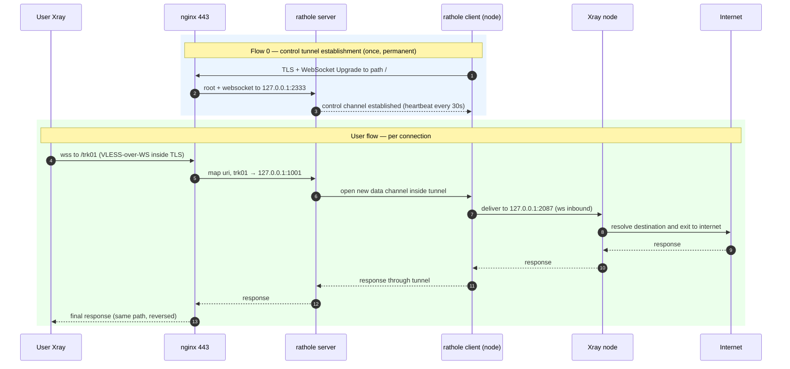

# Traffic Flow — Exact Packet Path

This document shows exactly what happens to a packet from the moment a user clicks "Connect" to the time it reaches the open internet, and what each component does at each layer.

> Assumptions for examples: domain `panel.example.ir`, node `trk01`, Xray inbound on node port `2087`, rathole local data port on Iran server `1001`, control port `2333`, fake site `8080`.

---

## Component Overview

```
┌─────────┐   ┌────────────── Iran Server (panel.example.ir) ────────────────┐   ┌──── Foreign Node (trk01) ────┐
│  User   │   │                                                               │   │                              │
│ (Xray   │   │  nginx :443 (TLS / Let's Encrypt)                             │   │  rathole client              │
│ client) │   │    map $uri           → local port                            │   │  Xray inbound (ws, no TLS)   │
└────┬────┘   │    map $http_upgrade  (root: fake or control)                 │   │  → exit to internet          │
     │        │                                                               │   └────────────┬─────────────────┘
     │(1)wss  │  rathole server (control :2333, data :1001, ...)              │                │
     │  /443  │  fake site + Pasargad panel (:8080)                           │◄──(0) control──┘
     └───────►│                                                               │     tunnel
              └───────────────────────────────────────────────────────────────┘   (node connects to Iran)
```

Two completely separate flows, both multiplexed on **one port 443 / one domain**:

- **Flow (0): Tunnel establishment** — once when the node starts, stays up permanently.
- **Flow (1→5): User data** — for each user connection, flows inside the established tunnel.

---

## Visual Diagrams

> Diagrams in `assets/` render as SVG:
> - `architecture.svg` — high-level architecture
> - `architecture-detailed.svg` — full reference: topology + nginx decision logic + port table + all three flows
> - `traffic-steps.svg` — step-by-step packet journey
> - `traffic-flow-flowchart.svg` / `traffic-flow-sequence.svg` — detailed flow

**Architecture:** 

**Full reference (all details):** 

**Step-by-step:** 

---

## Flowchart



---

## Sequence Diagram



---

## Flow 0: Control Tunnel Establishment (Node → Iran)

This happens before any user traffic and is the foundation of everything.

1. **rathole client** on the node dials `panel.example.ir:443` with TLS.
2. nginx receives the connection; the WebSocket Upgrade header routes it to the rathole control port `127.0.0.1:2333` (specifically to the secret control path `/_rh/<hex>`).
3. rathole server accepts the control channel; from this point the node is "connected."
4. Heartbeat every 30s keeps the channel alive. If it drops, rathole reconnects automatically.

> **Secret control path (v1.5.0+):** the control WebSocket path is `/_rh/<32 hex>` rather than `/`, so DPI cannot distinguish it from a regular page request. `ratholectl control-path show/rotate` manages this path.

---

## Flow 1–5: User Data

1. **User Xray client** connects to `wss://panel.example.ir:443/trk01` (VLESS-over-WS inside TLS).
2. **nginx** decodes the TLS, sees the path `/trk01`. The `map $uri $backend_port` directive maps it to local port `1001` (the rathole data port for node `trk01`).
3. nginx `proxy_pass`es to `127.0.0.1:1001` (rathole data listener).
4. **rathole server** receives the data and pushes it through the existing control tunnel to the rathole client on the node.
5. **rathole client** on the node delivers to `127.0.0.1:2087` (Xray inbound).
6. **Xray inbound** strips VLESS, resolves the real destination, and exits to the internet.

---

## Path Consistency Rule

If these three don't match, the user "connects but has no internet":

```
User VLESS config  ==  nginx location/map  ==  Xray node ws inbound path
     /trk01               ~^/trk01                    /trk01
```

The node name in `ratholectl` is the path, so creating node `trk01` aligns all three automatically.

---

## Direct-IP Traffic Flow

When `ratholectl direct on` is active, users can connect directly to the **Iran server IP** — no domain, no TLS.

```
User ──HTTP/8081──► nginx (:8081, no TLS)
                      ├── X-Cdn-Id: trk01  → map header → 1001 → rathole → node
                      ├── X-Cdn-Id: nld01  → map header → 1002 → rathole → node
                      └── unknown/no header → fake site
```

| Step | Layer | What happens |
|------|-------|--------------|
| 1 | User | WebSocket no TLS to `<IP>:8081`, header `X-Cdn-Id: trk01` |
| 2 | nginx | `map $http_x_cdn_id $direct_port` → rathole local port (`1001`) |
| 3 | rathole | opens data channel in existing tunnel |
| 4 | node | delivers to Xray inbound (`127.0.0.1:2087`) |
| 5 | Xray | exits to internet |

**Difference from standard path:** standard uses `wss://domain:443/trk01` + nginx TLS + `map $uri`; direct-IP uses `ws://IP:8081` + header + `map $http_<header>`. Both reach the same `127.0.0.1:1001`.

---

## Proxy Traffic Flow

When `ratholectl proxy add mysvc http://127.0.0.1:9000` is active, nginx creates a `location /<mysvc>/` that goes **directly to an upstream** — no rathole involved:

```
User ──wss://domain:443/mysvc/──► nginx (:443, TLS)
                                    └── location /mysvc/  →  proxy_pass → http://127.0.0.1:9000
                                                             (no rathole)
```

**Difference:** a normal tunnel goes nginx → rathole server → tunnel → foreign node → Xray. A proxy goes nginx → upstream directly (same server or any other host).

---

## Why This Design?

- **One port, one domain, one cert:** everything multiplexed behind nginx on 443; the operator maintains one cert.
- **Reverse topology:** foreign nodes connect to Iran (not the other way); the Iran server has a clean public domain/IP.
- **Camouflage:** tunnel and data traffic looks like regular HTTPS/WSS to a legitimate domain; a fake site on root adds cover.
- **Scalability:** adding a node = one line in `map` + one rathole service; all automated by `ratholectl add`.

For install and management details: [`README.fa.md`](README.fa.md) (Persian) or [`install-manual.md`](install-manual.md) (English).
